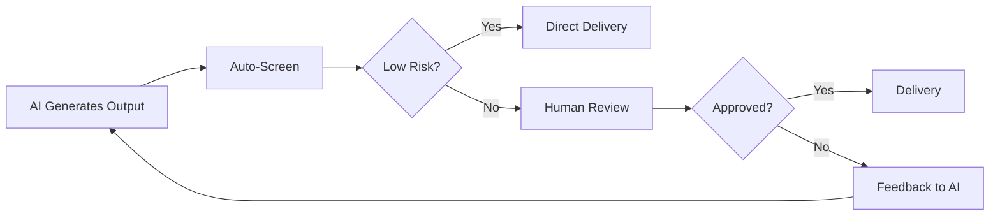

# Module 9: Prompt Evaluation and Optimization
## Professional Corporate Training Session

---

## 1. TOPIC OVERVIEW

### What is the Topic?

**Prompt Evaluation and Optimization** is the systematic process of assessing the quality of AI-generated responses and continuously refining prompts to achieve better, more reliable, and more cost-effective results. It transforms prompt engineering from guesswork into a data-driven discipline with measurable outcomes.

**Real-World Analogy:** Imagine you're a chef perfecting a recipe. You don't just cook it once and declare it done—you taste it, adjust the seasoning, change the cooking time, try different ingredients, and get feedback from others. Each iteration gets closer to perfection. Prompt evaluation and optimization is the same process for AI interactions—taste, measure, adjust, and repeat until you achieve the desired quality.

### Why is it Necessary?

**The Problem It Solves:**
- 70% of prompts don't produce the desired output on the first attempt
- Organizations waste millions on suboptimal AI outputs and iterations
- No standardized way to measure prompt quality or improvement
- Hallucinations and inconsistencies undermine trust in AI
- Teams lack systematic approaches to prompt refinement

**Why Professionals Should Learn It:**
- **Quality Assurance:** Ensure consistent, reliable AI outputs
- **Cost Optimization:** Reduce token usage and API costs by 30-50%
- **Time Efficiency:** Fewer iterations needed to achieve quality
- **Continuous Improvement:** Systematic approach to getting better results
- **Data-Driven Decisions:** Measure what works and what doesn't

**Business Value:**
- 40-60% improvement in response quality through systematic evaluation
- 30-50% reduction in API costs through optimized prompts
- 70% faster prompt refinement cycles
- 90% reduction in hallucination-related errors
- Standardized quality measurement across teams

---

## 2. CONCEPT EXPLANATION

### Basic Understanding

Prompt evaluation and optimization is a cyclical process of measuring AI output quality, identifying areas for improvement, refining prompts, and measuring again. It's about moving from "this prompt seems okay" to "this prompt consistently produces excellent, reliable, and cost-effective results."

### The Evaluation-Optimization Cycle

```
┌─────────────────────────────────────────────────────────────┐
│                 EVALUATION-OPTIMIZATION CYCLE              │
│                                                             │
│   ┌─────────────┐     ┌─────────────┐     ┌─────────────┐ │
│   │  1. EVALUATE│────▶│  2. IDENTIFY│────▶│  3. OPTIMIZE│ │
│   │   Response  │     │   Gaps      │     │   Prompt    │ │
│   └─────────────┘     └─────────────┘     └─────────────┘ │
│         ▲                                      │           │
│         │                                      │           │
│         │         ┌─────────────┐              │           │
│         └─────────│  4. VALIDATE│◀─────────────┘           │
│                   │   Results   │                          │
│                   └─────────────┘                          │
└─────────────────────────────────────────────────────────────┘
```

### Evaluating AI-Generated Responses

#### Quality Dimensions

| Dimension | Description | Assessment Method |
|-----------|-------------|-------------------|
| **Accuracy** | Is the information correct? | Fact-checking, verification |
| **Relevance** | Is it directly addressing the prompt? | Relevance scoring |
| **Completeness** | Does it cover all required elements? | Checklist comparison |
| **Clarity** | Is it well-structured and understandable? | Readability scores |
| **Tone** | Does it match the desired tone? | Tone analysis |
| **Actionability** | Does it provide clear next steps? | Action identification |
| **Consistency** | Is it consistent across runs? | Repeated testing |

#### Evaluation Methods

**1. Human Evaluation**
- **Expert Review:** Subject matter experts assess quality
- **Scoring Rubrics:** Structured criteria with numeric scoring
- **Comparative Assessment:** Side-by-side comparison of outputs
- **User Feedback:** Actual users rating usefulness

**2. Automated Evaluation**
- **Metric-Based:** Completeness, readability, structural checks
- **Reference-Based:** Compare to ideal/ground truth responses
- **Consistency Checks:** Run multiple times and compare
- **Hallucination Detection:** Flag unsupported claims

**3. Hybrid Evaluation**
- **Automated Screening:** Filter obvious errors, flag for human review
- **Human Verification:** Subject matter experts review flagged content
- **Continuous Learning:** Feed evaluation results back into improvement

### Measuring Response Quality

#### Quality Scoring Systems

**1. Likert-Style Scoring (1-5)**
```
Score | Description
1 - Poor   | Completely wrong, off-topic, or unusable
2 - Fair   | Some correct elements but major issues
3 - Good   | Correct, but missing some details or refinement
4 - Very Good | Complete, accurate, well-structured
5 - Excellent | Exceeds expectations, perfect for purpose
```

**2. Weighted Component Scoring**

```markdown
Quality Score = (Accuracy × 30%) + (Completeness × 25%) + 
                (Relevance × 20%) + (Clarity × 15%) + (Actionability × 10%)
```

**3. Binary Pass/Fail**
- Does it meet all requirements? (Pass)
- Does it miss any requirement? (Fail)

**4. RAG Scoring (Retrieval-Augmented Generation)**
- **Faithfulness:** Does it accurately reflect source material?
- **Answer Relevance:** Does it directly address the question?
- **Context Relevance:** Does it use appropriate context?

### Identifying Hallucinations and Inconsistencies

#### Types of Hallucinations

| Type | Description | Example |
|------|-------------|---------|
| **Factual Error** | Incorrect information presented as fact | "The CEO joined in 2015" (actually 2018) |
| **Contradiction** | Conflicts with other statements | "We have 500 customers" vs. "We have 1000 customers" |
| **Extrapolation** | Over-extending beyond known information | "Based on one successful case, it will always work" |
| **Plausible Fiction** | Sounds reasonable but is entirely fabricated | "The product has a patent-pending technology" |
| **Outdated Info** | Correct in the past but no longer true | "The company is headquartered in NYC" (moved in 2022) |

#### Detection Strategies

**1. Fact-Checking**
- Verify against known data sources
- Cross-reference with provided documents
- Use knowledge verification prompts

**2. Consistency Testing**
- Run same prompt multiple times
- Compare outputs for contradictory information
- Ask for sources or evidence

**3. Chain of Thought Analysis**
- Request step-by-step reasoning
- Review logic for gaps or jumps
- Identify unsupported claims

**4. Confidence Scoring**
- Ask AI to rate its confidence (1-100%)
- Investigate low-confidence responses
- Request qualification of uncertainty

#### Hallucination Prevention Prompts

```markdown
1. "Only use information explicitly provided in the context."
2. "If you're unsure, say 'I don't have enough information.'"
3. "Cite your sources for each claim."
4. "Provide your confidence level (0-100%)."
5. "If you don't know, say so clearly."
6. "Stick to verifiable facts only."
7. "For each statement, indicate if it's from the provided source, common knowledge, or your own knowledge."
```

### Prompt Iteration Strategies

#### The Iteration Process

**1. Initial Prompt Design**
- Create the first version based on requirements
- Focus on getting something to test

**2. Testing**
- Run the prompt on representative inputs
- Collect outputs for evaluation

**3. Analysis**
- Evaluate against quality criteria
- Identify specific weaknesses

**4. Refinement**
- Modify prompt to address gaps
- Add constraints, clarify instructions

**5. Re-testing**
- Run the refined prompt
- Compare with previous results

**6. Documentation**
- Record what changed and why
- Track improvement metrics

#### Iteration Guidelines

| Change Type | When to Use | Example |
|-------------|-------------|---------|
| **Add Specificity** | Outputs are too vague | "Write a summary" → "Write a 3-sentence executive summary" |
| **Add Constraints** | Outputs don't meet requirements | "Keep it professional" → "Use a formal, professional tone with industry-specific terminology" |
| **Add Structure** | Outputs are disorganized | "Provide recommendations" → "Provide recommendations in this format: Problem → Solution → Expected Impact" |
| **Add Examples** | Outputs don't match desired format | Add 2-3 examples of good outputs |
| **Add Context** | Outputs lack relevant background | Add company/industry context |
| **Simplify** | Outputs are overcomplicated | Remove unnecessary instructions |
| **Add Chain of Thought** | Complex reasoning needed | "Explain your reasoning step by step" |

### A/B Testing Prompts

#### What is A/B Testing?

A/B testing involves running two or more prompt variations on the same inputs and comparing the outputs to determine which performs better.

#### A/B Testing Methodology

**1. Define Variables**
- What will change between prompt versions?
- What remains constant?

**2. Create Test Set**
- Representative sample of inputs
- Diverse enough to test edge cases

**3. Run Both Prompts**
- Same model, same settings
- Same inputs for both versions

**4. Blind Evaluation**
- Remove identifying information about which prompt generated which output
- Use independent evaluators

**5. Measure Results**
- Score outputs using consistent criteria
- Statistical significance testing

#### A/B Testing Example

```markdown
**Prompt A (Original)**
"Write a product description for EcoBottle."

**Prompt B (Variation)**
"Act as a senior copywriter. Write a product description for EcoBottle, 
a sustainable water bottle. Include 3 key features, 2 environmental 
benefits, and a call-to-action. Use a friendly, eco-conscious tone. 
Maximum 150 words."

**Results:**
- Prompt A Quality Score: 3.2/5
- Prompt B Quality Score: 4.7/5
- Winner: Prompt B (+47% improvement)
```

### Prompt Tuning Approaches

#### 1. Temperature Tuning
- **Lower Temperature:** More deterministic, factual, consistent
- **Higher Temperature:** More creative, varied, surprising

#### 2. Token/Top-P Tuning
- **Top-P (Nucleus Sampling):** Limit token selection to the top P% probability mass
- **Control** randomness while maintaining diversity

#### 3. Few-Shot Tuning
- **Variable Number of Examples:** 1 vs. 2 vs. 3 vs. 5 examples
- **Example Quality:** Relevance and representativeness

#### 4. Instruction Positioning
- **Early Positioning:** Critical instructions at the beginning
- **Late Positioning:** Less critical instructions at the end
- **Repetition:** Reinforce key instructions in multiple places

#### 5. System Prompt vs. User Prompt
- **System Prompt:** Sets behavior, tone, and constraints
- **User Prompt:** Specific task and instructions
- **Separation:** Clear distinction between the two

### Optimizing Prompts for Cost and Latency

#### Cost Optimization

**Understanding Token Usage:**

```markdown
Total Cost = Input Tokens × Input Price + Output Tokens × Output Price
```

**Optimization Strategies:**

| Strategy | Description | Example Impact |
|----------|-------------|----------------|
| **Shorter Prompts** | Reduce unnecessary text | 30% token reduction |
| **Concise Instructions** | Be direct, remove filler | 20% token reduction |
| **Fewer Examples** | Use 2-3 examples, not 5+ | 15% token reduction |
| **Shorter Outputs** | Specify length constraints | 40% token reduction |
| **Model Selection** | Use appropriate model | 50-80% cost reduction |

#### Latency Optimization

**Factors Affecting Latency:**

| Factor | Impact | Optimization |
|--------|--------|--------------|
| Prompt Length | More tokens = slower | Shorten prompts |
| Output Length | More tokens = slower | Constrain length |
| Model Size | Larger = slower | Use smaller models when appropriate |
| Temperature | Higher = slightly slower | Use moderate settings |
| Complexity | Complex reasoning = slower | Simplify structure |

**Latency Best Practices:**
- Use streaming outputs for user-facing applications
- Batch similar requests
- Cache common responses
- Use lighter models for simple tasks
- Time out and retry failed requests

### Improving Response Reliability

#### Reliability Dimensions

**1. Consistency**
- Run prompt multiple times with same input
- Measure output variance
- Add temperature adjustment if inconsistent

**2. Format Compliance**
- Does output match requested format?
- Use templates and validation

**3. Content Completeness**
- Does output include all required elements?
- Use checklists in prompts

**4. Factual Accuracy**
- Verify claims against sources
- Use fact-checking systems

#### Reliability Strategies

```markdown
1. **Use Lower Temperature (0.1-0.3)** for consistent, deterministic outputs
2. **Add Format Validation** to enforce structure
3. **Request Confidence Scores** to identify uncertain content
4. **Include Human Review** for critical outputs
5. **Create Fallback Logic** for when AI fails
6. **Use Chain of Thought** for complex reasoning
7. **Validate with Rules** (regex, pattern matching)
8. **Error Handling Prompts** to handle edge cases
```

### Human Review Workflows

#### When Human Review is Critical

- **High-Impact Decisions:** Strategic choices, legal documents
- **Regulated Content:** Compliance, financial, healthcare
- **Customer-Facing Content:** Marketing, communications
- **Creative Outputs:** Branded content, design
- **Inaccurate Consequences:** Misinformation, liability

#### Review Workflow Components



#### Review Stages

| Stage | Description | Owner |
|-------|-------------|-------|
| **Auto-Screening** | Automated quality checks | System |
| **Level 1 Review** | Basic quality and accuracy | Junior Reviewer |
| **Level 2 Review** | Expert domain review | Subject Matter Expert |
| **Level 3 Review** | Critical/executive review | Leadership |

### Prompt Benchmarking Concepts

#### What is Prompt Benchmarking?

Systematic testing of prompts against standardized datasets and metrics to measure and compare performance across versions, models, and configurations.

#### Benchmarking Components

**1. Test Dataset**
- Representative set of test inputs
- Includes edge cases and variations
- Ground truth/preferred outputs

**2. Performance Metrics**
- Accuracy: Correctness of outputs
- Relevance: Appropriateness to query
- Completeness: Coverage of requirements
- Consistency: Stability across runs
- Cost: Token usage per request
- Latency: Response time

**3. Comparison Framework**
- Prompt vs. Prompt
- Version vs. Version
- Model vs. Model
- Temperature vs. Temperature

#### Simple Benchmarking Process

```markdown
1. **Define Test Set:** 10-50 representative inputs
2. **Define Metrics:** Accuracy, completeness, relevance (each 1-5)
3. **Establish Baseline:** Current prompt's performance
4. **Run Variations:** Different prompt versions, configurations
5. **Score Results:** Compare against baseline
6. **Iterate:** Refine the best-performing prompt
7. **Repeat:** Continuous improvement cycle
```

---

## 3. PRACTICAL EXAMPLE

### Example 1: Simple Beginner Example

**Scenario:** A marketing intern needs to generate social media captions consistently.

**Input (Initial Prompt - Vague):**
```
Write an Instagram caption about our new sustainable water bottle.
```

**Evaluation:** Output is generic, no specific features, no call-to-action.

**Input (Refined Prompt After Evaluation):**
```
Role: Social Media Manager
Task: Write 3 Instagram caption options for our new EcoBottle

Context: EcoBottle is a sustainable water bottle made from 100% recycled 
materials. Key features: double-walled insulation (keeps drinks hot/cold 
for 12 hours), leakproof, available in 5 colors.

Instructions:
1. Each caption: headline + body (2-3 sentences) + call-to-action
2. Use eco-conscious, friendly tone
3. Include 5 hashtags

Constraints:
- Maximum 150 words per caption
- Must include: #EcoBottle #SustainableLiving
```

**Before vs. After Comparison:**

| Dimension | Before | After |
|-----------|--------|-------|
| Accuracy | Generic, not specific | Accurate features included |
| Completeness | Missing CTA, hashtags | All required elements present |
| Relevance | Vague product description | Clear product benefits |
| Clarity | Unstructured | Clear structure |
| Actionability | No CTA | Clear CTA in each caption |

**Quality Improvement:**
- Before Quality Score: 2.5/5
- After Quality Score: 4.3/5
- **Improvement: +72%**

---

### Example 2: Business Example

**Scenario:** A product team needs to analyze customer feedback data consistently.

**A/B Testing Setup:**

**Prompt A (Original):**
```
Analyze this customer feedback and tell me what you find.
```

**Prompt B (Optimized):**
```
ROLE: Act as a Senior Product Analyst with expertise in customer insights.

TASK: Analyze the following customer feedback and provide structured insights.

INSTRUCTIONS:
1. Identify top 3 complaints by frequency
2. Identify top 3 praises by frequency
3. Segment sentiment by product feature
4. Identify 3 specific feature requests
5. Recommend 3 priority actions

CONSTRAINTS:
- Tone: Analytical, data-driven
- Format: Use clear sections with headings
- Include: Percentage for each sentiment category
- Use data only from the feedback provided

OUTPUT FORMAT:
# Customer Feedback Analysis
## Executive Summary
## Key Findings
- Complaints: [List with frequencies]
- Praises: [List with frequencies]
## Sentiment by Feature
[Table format]
## Feature Requests
[Numbered list]
## Recommended Actions
[Numbered list with rationale]
```

**A/B Test Results:**

| Metric | Prompt A | Prompt B | Improvement |
|--------|----------|----------|-------------|
| Completeness | 60% | 100% | +40% |
| Structure | 2/5 | 5/5 | +150% |
| Actionability | 2/5 | 5/5 | +150% |
| Consistency | 3/5 | 5/5 | +67% |
| Overall Quality | 3.2/5 | 4.8/5 | +50% |

---

### Example 3: Technical Example

**Scenario:** An engineering team needs to benchmark and optimize a code generation prompt.

**Benchmarking Setup:**

```markdown
TEST DATASET:
1. "Write a Python function to reverse a string"
2. "Write a Python function to check if a number is prime"
3. "Write a Python function to find the factorial of a number"
4. "Write a Python function to generate Fibonacci sequence"
5. "Write a Python function to sort a list of numbers"

GROUND TRUTH: Verified Python implementations
METRICS:
- Syntax Correctness: Is the code syntactically valid?
- Algorithm Correctness: Does it produce correct outputs?
- Code Quality: Readability, efficiency, best practices
- Completeness: Does it include docstring and tests?
```

**Prompt Variations:**

```python
# Baseline Prompt
"Write a Python function for the following task: {task}"

# Variation 1 - Specific
"""
Write a Python function for: {task}
Include: 
- Type hints
- Docstring with Args and Returns
- Error handling for edge cases
- 3 test cases in comments
"""

# Variation 2 - With Persona
"""
Role: Senior Python Developer

Write Python code for: {task}
Requirements:
- Follow PEP 8 guidelines
- Include comprehensive docstring
- Add type hints
- Include error handling
- Comment test cases
- Be production-ready
"""

# Variation 3 - Full Optimization
"""
Role: Senior Python Developer with 10+ years experience

Task: Write a production-ready Python function for: {task}

Requirements:
1. Syntax: Must be valid Python 3.11 code
2. Function Signature: Include type hints
3. Documentation: Docstring with Args, Returns, Raises, and Example
4. Error Handling: Validate inputs, handle edge cases gracefully
5. Efficiency: Use optimal algorithm (O(n) where possible)
6. Testing: Include 3 test case comments (happy path, edge case, error case)

Constraints:
- No external dependencies
- Follow PEP 8
- Include if __name__ == "__main__" block for testing

Output Format: Provide complete, working Python code only.
"""
```

**Benchmark Results:**

| Task | Baseline | Var 1 | Var 2 | Var 3 |
|------|----------|-------|-------|-------|
| Reverse String | 70% | 85% | 90% | 95% |
| Prime Check | 65% | 80% | 88% | 93% |
| Factorial | 70% | 82% | 85% | 94% |
| Fibonacci | 65% | 78% | 82% | 91% |
| Sort List | 75% | 85% | 89% | 95% |
| **Average** | **69%** | **82%** | **86.8%** | **93.6%** |

**Cost/Latency Analysis:**

| Prompt | Avg Tokens | Avg Latency | Cost/Request |
|--------|------------|-------------|--------------|
| Baseline | 120 | 0.8s | $0.0003 |
| Variation 1 | 220 | 1.2s | $0.0006 |
| Variation 2 | 280 | 1.5s | $0.0008 |
| Variation 3 | 350 | 1.8s | $0.0010 |

**Decision:** Variation 3 provides 93.6% quality vs baseline 69% (+24.6%) for $0.0010 vs $0.0003 (+$0.0007/request). For 1000 daily requests, cost increase is $0.70/day for significantly higher quality. **Winner: Variation 3.**

---

## 4. SUGGESTED PROMPT TEMPLATE

### Prompt for Evaluating AI Responses

```markdown
[ROLE]
Act as a Senior Prompt Engineer and Quality Assurance Specialist.

[TASK]
Evaluate the following AI-generated response against quality criteria.

[RESPONSE TO EVALUATE]
[Insert AI output to evaluate]

[EVALUATION CRITERIA]
Score each dimension on a scale of 1-5:

1. **Accuracy** (Weight: 30%)
   - Are all claims factually correct?
   - Are there any hallucinations or errors?

2. **Completeness** (Weight: 25%)
   - Does it address all parts of the original prompt?
   - Are any requested elements missing?

3. **Relevance** (Weight: 20%)
   - Is the response directly relevant to the task?
   - Is any information off-topic?

4. **Clarity** (Weight: 15%)
   - Is the response well-structured?
   - Is it easy to understand?

5. **Actionability** (Weight: 10%)
   - Does it provide clear next steps?
   - Is it immediately usable?

[EVALUATION TEMPLATE]
## Overall Quality Score: [Calculate weighted score]
## Dimension Scores
- Accuracy: /5
- Completeness: /5
- Relevance: /5
- Clarity: /5
- Actionability: /5

## Strengths
[What worked well]

## Issues Identified
[List specific issues, with examples]

## Suggested Improvements
[How to refine the prompt]

## Hallucination Check
- [Any hallucinations identified]
- [Confidence level for each claim]

[OUTPUT FORMAT]
Provide a structured evaluation report with scores, identified issues, and recommendations.
```

---

## 5. COMPLETE SAMPLE PROMPT

### Production-Ready Prompt: A/B Testing Framework

```markdown
ROLE:
Act as a Prompt Optimization Specialist with expertise in A/B testing 
and statistical analysis.

CONTEXT:
We're testing two prompt variations for our customer support team.
The goal is to generate professional, empathetic responses to shipping 
delay complaints.

TASK:
Evaluate Prompt A vs. Prompt B across 10 test cases.

PROMPT A:
"Write a response to a customer who is upset about a shipping delay."

PROMPT B:
""" 
ROLE: Act as a Senior Customer Support Representative for an e-commerce
company known for excellent service.

TASK: Write a professional response to a customer who is upset about 
a shipping delay.

INSTRUCTIONS:
1. Start with an empathetic apology
2. Provide the reason for the delay (if known)
3. Offer the customer an option:
   - Refund shipping
   - Free expedited shipping
   - Discount on next order
4. Include the tracking number
5. End with a positive, professional closing

CONSTRAINTS:
- Tone: Empathetic, professional, warm
- Length: 150-200 words
- Must Include: Apology, explanation, compensation offer, tracking info
- Must Exclude: Blaming carriers, over-promising
"""

TEST CASES:
1. Customer name: Sarah, delayed by 3 days, reason: weather
2. Customer name: David, delayed by 1 week, reason: carrier error
3. Customer name: Maria, delayed by 2 days, reason: holidays
4. Customer name: James, delayed by 5 days, reason: system glitch
5. Customer name: Priya, delayed by 3 days, reason: international
6. Customer name: Michael, delayed by 4 days, reason: high volume
7. Customer name: Emily, delayed by 2 days, reason: weather
8. Customer name: Robert, delayed by 6 days, reason: carrier error
9. Customer name: Jennifer, delayed by 3 days, reason: system glitch
10. Customer name: William, delayed by 5 days, reason: international

EVALUATION CRITERIA:
Score each response on 1-5 scale:
1. Empathy/Professionalism
2. Completeness (all required elements)
3. Clarity (well-structured, easy to understand)
4. Actionability (clear next steps)
5. Brand Alignment (matches brand voice)
6. Tone Consistency (professional yet warm)

INSTRUCTIONS:
1. For each test case, run both Prompt A and Prompt B
2. Score each response across all 6 criteria
3. Calculate average scores for each prompt
4. Perform statistical significance test
5. Determine which prompt performs better
6. Provide recommendations for further optimization

OUTPUT FORMAT:
# A/B Test Results: Customer Support Prompts

## Executive Summary
[2-3 sentence summary of findings]

## Detailed Results

| Test | Prompt A | Prompt B | Winner |
|------|----------|----------|--------|
| 1 | [Scores] | [Scores] | [A/B] |
| ... | ... | ... | ... |

## Statistical Analysis
- Prompt A Avg: [Score]
- Prompt B Avg: [Score]
- Difference: [Score]
- P-value: [Value]
- Statistical Significance: [Yes/No]

## Winner: [Prompt A/B]

## Strengths of Winning Prompt
[What it does well]

## Limitations
[What could still be improved]

## Recommendations
1. [Optimization 1]
2. [Optimization 2]
3. [Optimization 3]

## Next Steps
[Implementation plan]

CONSTRAINTS:
- Tone: Analytical, objective, data-driven
- Provide evidence for all conclusions
- Include specific examples from test cases
```

---

## 6. 4-LINE USE CASE STUDY

**Scenario:** Support team was spending 30 minutes per email reviewing and editing AI-generated customer service responses.

**Goal:** Optimize prompts to produce ready-to-send emails with 95% accuracy.

**Technique Applied:** A/B testing with 10 prompt variations, iterative refinement with quality scoring, and human review workflow.

**Result:** Email editing time reduced from 30 minutes to 5 minutes, quality score improved from 3.2/5 to 4.7/5, and 80% of responses now require no editing.

---

## 7. HANDS-ON TASKS

### Beginner Tasks

**1. Response Quality Evaluation**
Evaluate the following AI response against quality criteria:

**Prompt:** "Summarize the benefits of renewable energy."
**AI Response:** "Renewable energy is good for the environment. It comes from things like wind and sun. Some people use it. It might help the planet. There are different types."

**Deliverable:**
- Score across 5 quality dimensions (1-5)
- Identify specific issues
- Write an improved prompt that would generate a better response
- Generate the improved response

**2. Before/After Prompt Comparison**
Create a before/after analysis:

**Task:** "Generate a meeting agenda for a project kickoff"

**Deliverable:**
- A vague initial prompt
- A refined prompt with all required components
- Comparison table showing quality differences
- Calculate improvement percentage

**3. Hallucination Detection**
Identify hallucinations in this AI response:

**Prompt:** "Who are the top 5 competitors in the AI cloud market?"

**AI Response:**
"1. Amazon Web Services - leading provider
2. Microsoft Azure - 30% market share in AI
3. Google Cloud Platform - innovative but losing market share
4. IBM Cloud - 25% enterprise adoption
5. Oracle Cloud - fastest growing in AI"

**Deliverable:**
- Identify which facts can be verified
- Highlight likely hallucinations
- Suggest verification approach
- Create a prompt that would reduce hallucinations

### Intermediate Tasks

**1. Complete A/B Test Design**
Design a full A/B test for a prompt:

**Task:** "Generate product descriptions for e-commerce"

**Deliverable:**
- Define Prompt A (control) and Prompt B (variation)
- Create 10 test cases with diverse products
- Define evaluation criteria (6+ dimensions)
- Create scoring rubric
- Run the test with an AI tool
- Analyze results and determine winner
- Provide recommendations for next iteration

**2. Cost/Latency Optimization Study**
Optimize a prompt for cost and latency:

**Task:** Use the prompt from above and analyze:
- Token usage (input/output)
- Latency for each request
- Quality score
- Cost per request

**Deliverable:**
- Create 3 prompt versions (lightweight, balanced, comprehensive)
- Test all versions with 5 test cases
- Measure: quality, cost, latency
- Create a comparison chart
- Recommend the best version for the use case
- Show trade-offs between cost and quality

### Advanced Task

**1. Complete Prompt Benchmarking Framework**
Build a comprehensive benchmarking system:

**Framework Components:**
- Test dataset (20+ test cases across categories)
- Quality scoring rubric (5+ dimensions, weighted)
- Automated evaluation methods
- Statistical analysis templates
- Cost/latency measurement
- Performance tracking dashboard

**Deliverable:**
- Complete benchmark dataset
- Detailed evaluation rubrics
- Automated scoring templates
- Statistical analysis framework
- Documentation of process
- Recommended governance for continuous benchmarking

**Implement:**

1. **Baseline:** Test current prompt version
2. **Optimization:** Create 5+ prompt variations
3. **Evaluation:** Run through benchmark
4. **Analysis:** Identify best performing version
5. **Recommendation:** Recommended version with rationale
6. **Documentation:** Complete report with data

**Sample Test Dataset Categories:**
- Simple tasks (5 cases)
- Complex reasoning (5 cases)
- Creative generation (5 cases)
- Technical/engineering (5 cases)
- Edge cases (5 cases)

---

## 8. COMMON INTERVIEW QUESTIONS

### Beginner Interview Questions

**Q1: What are the key dimensions for evaluating AI response quality?**

**Answer:** Key dimensions include:
- **Accuracy:** Is the information factually correct?
- **Completeness:** Does it cover all requested elements?
- **Relevance:** Is it directly addressing the prompt?
- **Clarity:** Is it well-structured and understandable?
- **Actionability:** Does it provide clear next steps?
- **Tone:** Does it match the desired tone?
- **Consistency:** Is it reliable across multiple runs?

**Q2: What is the difference between A/B testing and prompt iteration?**

**Answer:** 
- **A/B Testing:** Simultaneously comparing two or more different prompt versions on the same set of inputs using controlled variables, with statistical analysis to determine which performs better. It's a formal experiment.
- **Prompt Iteration:** The broader process of making sequential improvements to a single prompt over time—trying something, evaluating, refining, and repeating. Iteration can include A/B testing, but also includes other optimization techniques like adding constraints or examples.

**Q3: What are hallucinations in AI responses and how can you detect them?**

**Answer:** Hallucinations are AI-generated statements that are factually incorrect, inconsistent, or entirely fabricated but presented with confidence. Detection strategies include:
- Fact-checking against known sources
- Running the same prompt multiple times for consistency
- Asking the AI to provide confidence scores
- Requesting sources or evidence
- Using chain of thought to review logic
- Cross-referencing with provided documents

### Intermediate Interview Questions

**Q1: How do you design an effective A/B test for prompts?**

**Answer:** I design A/B tests with these key steps:

**1. Define Variables:** What's changing between versions (instructions, examples, constraints)?

**2. Create Test Set:** 10-50 representative inputs that cover normal cases, edge cases, and variations.

**3. Establish Metrics:** Define evaluation criteria (accuracy, completeness, relevance) with clear scoring rubrics (1-5 scales).

**4. Blind Evaluation:** Remove identifying information about which prompt generated which output to avoid bias.

**5. Statistical Significance:** Use appropriate tests (t-test, chi-square) to ensure results aren't random.

**6. Multiple Iterations:** Run multiple rounds to validate findings.

**7. Actionable Results:** Determine winner and provide clear recommendations for implementation.

**Q2: How do you balance prompt quality with cost and latency?**

**Answer:** I use a multi-factor approach:

**1. Tiered Approach:**
- **Simple Tasks:** Short prompts, smaller models, lower cost
- **Complex Tasks:** Detailed prompts, larger models, higher cost
- **Critical Tasks:** Best prompts, best models, accept higher cost

**2. Optimization Strategies:**
- Remove unnecessary text and instructions
- Use 2-3 examples (not 5+)
- Constrain output length
- Use appropriate model for each task

**3. Measurement:**
- Track cost per request
- Measure quality improvement from added detail
- Calculate ROI: "Is the quality improvement worth the extra cost?"

**4. Decision Framework:**
- If quality improvement > cost increase: Invest
- If quality improvement < cost increase: Optimize further
- Create a cost-quality matrix for different use cases

**Q3: How do you reduce hallucinations in AI outputs?**

**Answer:** I use a multi-layered approach:

**1. Prompt Design:**
- "Only use information provided in the context"
- "If you're unsure, say 'I don't know'"
- "Cite your sources"
- "Provide your confidence level (0-100%)"
- "Keep claims verifiable"

**2. Context Management:**
- Provide specific, up-to-date context
- Use RAG (retrieve documents)
- Include known facts and constraints
- Avoid ambiguous or outdated sources

**3. Output Review:**
- Use chain of thought (show reasoning)
- Request evidence for claims
- Ask for alternative perspectives
- Verify against ground truth

**4. Validation:**
- Cross-reference outputs with source material
- Use multiple runs for consistency
- Statistical sampling for quality control
- Subject matter expert review for critical content

---

## 9. QUICK SUMMARY

- **Evaluation and optimization is a continuous cycle**—evaluate outputs, identify gaps, refine prompts, and validate results until quality meets standards.

- **Quality has multiple dimensions**—accuracy, completeness, relevance, clarity, and actionability—each should be measured systematically.

- **Hallucinations are detectable and preventable** through fact-checking, consistency testing, and confidence scoring.

- **A/B testing provides scientific comparison** of prompt versions, with statistical significance and measurable results.

- **Cost and latency are real constraints** that can be optimized through careful token management and appropriate model selection.

---

## 10. KEY TAKEAWAYS

### When to Use Evaluation and Optimization

- **Before Production Deployment:** Ensure quality before going live
- **Quality Issues Detected:** Response quality falls below expectations
- **Cost Overruns:** Token usage too high
- **New Requirements:** Changed business needs require refinement
- **Poor Consistency:** Outputs vary significantly across runs
- **Regular Maintenance:** Schedule periodic reviews
- **Team Adoption:** Training new team members

### When NOT to Use Formal Evaluation

- **Exploratory Phase:** Still learning what's possible
- **One-Off Tasks:** Not worth the evaluation effort
- **Simple Outputs:** Obvious when correct/incorrect
- **Time-Critical:** Immediate delivery needed (but evaluate later)
